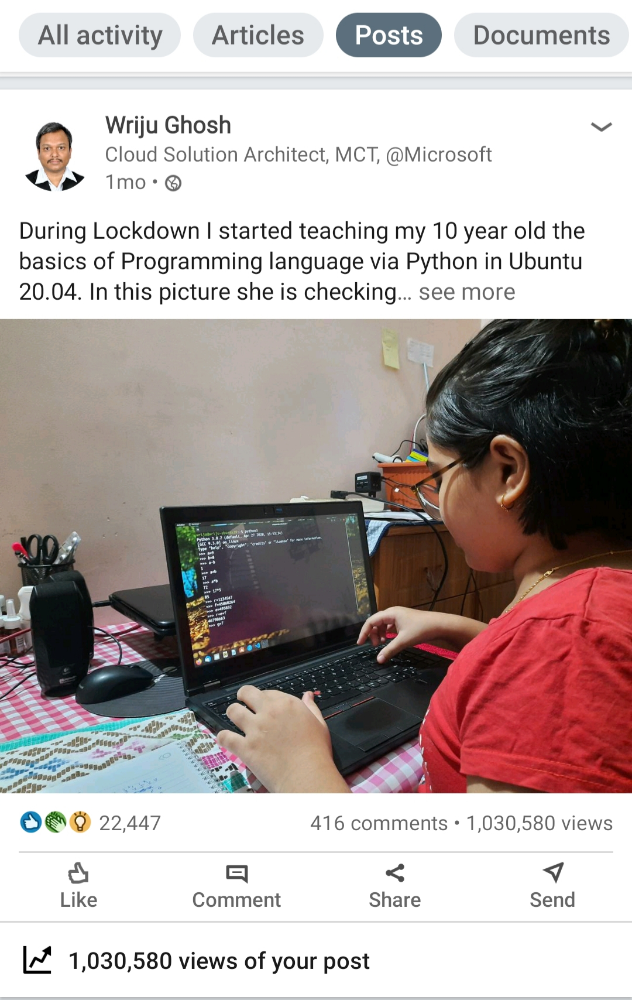

# Introduction

Welcome to my class of **Learning Programming for Studnets with Python**.

Python is easy and going to stay very long. Investing time on learning Python will not go waste at all. To start learning programming one has to start using some language. Python is right fit. Many A-class instituations today made Python learning mandatory. You will see people now coming from different backgrounds knows Python. It is like learning to use Office products. One day this will just be default.

## License

This is an open source courseware, anyone is free to use the content for non commercial purpose. If you are  using this course and charging money from students then please don't do so. I have designed and created the content from my own experience and the open web resources available across different free learning portal.

## A bit of History

During Covid-19 lockdown my 10-year-old daughter finished her class after the final exam. We had a lot of planning which included visiting our hometown and then a lot of other summer activities were planned. We could not do any. Our nice little daughter kind of adjusted to the new normal. However, full of energy to burn out. I decided to let her explore [code.org](http://code.org) and she really enjoyed and finished all of them. Then I was in search of what to teach. As a developer I got an exposure to learn few programming languages and out of all I've picked up **Python** because of its sheer simplicity. Rather than jumping into a lot of object oriented ornaments, it gives the script like experience with all modern programing language constructs. That is why it the popular programming language in colleges. I posted a pic of her coding in Python. It was viral and many approached me on how to start. 

I was amazed to see the interest among parents and gurdians for their kids. For Python we have more than enough resources available but not always fit for school students. Hence I decided to come up with a content by myself. But then who will validate it? I thought let me bring in a batch and while delivering them I will keep adding here. So that I know if it matches at par. So finally after enough delay we started Oct 2020 and after 10 classes ended it in 5 Dec 2020.

With a heavy heart I wrote them a closing email. I will miss my first batch. Because they were influencial building this content. But I was happy to see this project took some shape. I hope this would be helpful for others too.

## In memory of

I am a son of a legendary teacher who has many fan following. I wanted to dedicate this to my dad **Mr. Debajyoti Ghosh**. He was an inspirational legendary science teacher with many amazing students around the globe. I am proud to be his son.

## Disclaimer

As a parent/guardian please decide if you kid is ready for it. Check with [code.org](http://code.org) if your kid has a natural interest. I would highly recommend you decide on this aspect. Your kids' interest matter. May be your kid is destined to become greatest Painert or Pop Singer. So please give this a chance.

### Contact

Contact me via my Twitter [@wrijugh](https://twitter.com/wrijugh)

## Website

Website Link [https://wrijugh.github.io/python-for-kids/](https://wrijugh.github.io/python-for-kids/)

GitHub Repository [https://github.com/wrijugh/python-for-kids](https://github.com/wrijugh/python-for-kids)

Subscribe to the [YouTube Channel](https://www.youtube.com/playlist?list=PLH60I37xI-jmDGHF1S_2ld5Gb7x0tP0Fp)

Facebook page [https://www.facebook.com/CodeKidAll](https://www.facebook.com/CodeKidAll)

---

[Next: Index](index.md)
